

----

    This is the README file for my Code Institute MS3 project site, Foodie - The Recipe Sharing Site

    This project is the 3rd project as part of the Code Institute Full Stack Development course. The projects are set in order to demonstrate my understanding of what we have learnt during the previous units.
    The task set for this project is to demonstrate the ability to create a fully responsive web application that allows users to interact and manipulate with data stored in a database.

 

[CLICK HERE TO VISIT THE LIVE SITE](https://ts-foodie.herokuapp.com/) 

----
 

# Table Of Content:

- <a href="#project_goals">Project Goals</a>
- <a href="#ux">User Experience (UX)</a>
    - <a href="#ux-user_stories">User Stories</a>
    - <a href="#ux-design">Design</a>
        - <a href="#ux-design-color">Color</a>
        - <a href="#ux-design-color">Typography</a>
        - <a href="#ux-design-color">Images</a>
        - <a href="#ux-design-structure">Structure & Mockup Designs</a></a>
        - <a href="#ux-design-amendments">Amendments To Mockup Designs During Development</a></a>
- <a href="#features">Features</a>
    - <a href="#features-current">Current Features</a>
    - <a href="#features-future">Possible Future Features</a>
- <a href="#database">Database</a>
- <a href="#key-components">Key Components</a>
    - <a href="#key-components-languages">Languages</a>
    - <a href="#key-components-frameworks">Frameworks & Libraries</a>
    - <a href="#key-components-others">Others</a>
- <a href="#testing">Testing</a>
    - <a href="#testing-html">HTML</a>
    - <a href="#testing-css">CSS</a>
    - <a href="#testing-javascript">Javascript</a>
    - <a href="#testing-pep8">PEP8 Compliance</a>
    - <a href="#testing-lighthouse">Overall Website Performance & Compatibility </a>
    - <a href="#testing-responsive-design">Responsive Design</a>
    - <a href="#testing-browser-compatibility">Browser Compatibilty</a>
    - <a href="#testing-links">Link Testing</a>
    - <a href="#testing-user-stories">User Story Testing</a>
    - <a href="#testing-problems-during-development">Problems During Development</a>
    - <a href="#testing-bugs">Known Bugs</a>
- <a href="#deployment">Deployment</a>
    - <a href="#deployment-github">Deployment Through GitHub Pages</a>
    - <a href="#deployment-forking">Forking</a>
    - <a href="#deployment-cloning">Cloning Project</a>
    - <a href="deployment-admin">Administrator Access Credentials</a>
- <a href="#credits">Credits</a>
    - <a href="#credits-content">Content</a>
    - <a href="#credits-media">Media</a>
    - <a href="#credits-code">Code</a>
    - <a href="#credits-acknowledgments">Acknowledgements</a>

----

# Project Goals

*   Design, develop and implement a full stack web application using HTML, CSS, JavaScript, Python, Flask and MongoDB
*   Identify and apply necessary security features

# User Experience (UX)

    This section is designed to generate possible scenarios of the typical end user that would use this website. 
    This will help ensure end user requirements are designed into the website.

    To create a web application that offered a good experience to the user, I found that a minimal and simplistic style would be the best approach. 
    Not only does this keep the site easy to use, it also makes sure that the users aren't over powered with all the information the database may store/display.   

    A key priority was to try to make the journey from entering the site to displaying a recipe as quickly and clean as possible.

## <b>User Stories</b>

* ### <b>User Experience</b>

    - When I visit the site, I want to know that I have landed on the correct site that I intended to visit.

    - I need to be able to navigate to the key elements of the site quickly.

    - The website should load correctly on any device.

    - The website should load quickly and only load the necessary files required to display the key elements of the site first to improve load times.

    - Site visitors should be able to find social links to engage and share recipes to friends through their social media connections.

* ### <b>First Time Visitor Goals</b>

    - First Time Visitors, should be able to understand the purpose and reason for the site.

    - First Time Visitors, should be able to easily find the navigation links.

    - First Time Visitors, should be able to interact with the site upon landing on the site.

    - First time users should be able to view the recipes on the site without having to log in or register for an account.

    - First time users are likely to be un-registered users and must have restricted access to certain areas of the site.

    - First time users are able to navigate the site without registering. However in order to submit a recipe to the site, users must register and therefore the user must be able to locate the Register link on the hompeage easily and quickly.

* ### <b>Returning Visitor Goals</b>

    - A returning visitor would typically be a user that has already registered with the website, therefore the user should be able to locate the log in link easily and quickly on the homepage.

    - A returning visitor should be able to make changes to any recipes they have uploaded onto the site, but must not be able to edit or remove entries entered by the site admin or other users.

* ### <b>Website Administrator Goals</b>

    - The website administrator must be able to find the administrator tools when logged into the site.

    - The website administrator must not be able to delete the main administrator account from the database.

    - The website administrator must be able to create, remove, update and delete recipe categories.

    - The website administrator must be the only users to have access to the restricted websites and non-administrators must not be able to access restricted sites by direct URL inputs.

## <b>Design</b>

* ### <b>Color</b>

    When choosing the most suitable color scheme for the site, I decided to list the main points of what I wanted to try to create from the design.

    Here are the key points to consider when choosing the colors:

    * Eye Catching
    * Comfertable
    * Color Compatibility

    I chose to develop both the logo and the main site theme at the same time to ensure that they could work well together. 
    The colors were going to be an important part of the design in order to create a brand that could be applied throughout the company should it be required in the future.

    To choose a compatible color scheme, I decided to use [Adobe Color](https://color.adobe.com/) to find colors that would work well together. 
    I began by choosing a base color that I thought would work well for the brand, then entered the color codes into the site and it came up with other colors that would work well in combination with the colors I had already entered. When [Adobe Color](https://color.adobe.com/) displayed the result, it stated 'No conflicts found. Swatches are color blind safe.'

    

    After finding the colors I felt were most suitable I implemented them into the site, in later stages of development I began testing the site's compatibility using [Adobe Color](https://developers.google.com/web/tools/lighthouse) and it was brought to my attention that the way I was using the colors was not meeting lightroom's accessibility criterion due to contrasting colors. I have explained further in my testing section on the steps I had to take to overcome this issue.

* ### <b>Typography</b>

    When choosing which font to use as part of my design, I felt it was important for it to be easy to read but have similar feel as a font you would choose for a restraunt menu. I wanted the font to be appropriate so that I could use it for the logo text and also the main site text. This would then help maintain a nice continuity within the design and also help create the 'Foodie' brand I was aiming for.

    I have used Google to source the fonts and these are loaded within the head of the page.

    The main font is [Lobster](https://fonts.google.com/specimen/Lobster?query=lobster)

    This is the font I used for fancy headings and labelling.

    The secondary font is [Oswald](https://fonts.google.com/specimen/Oswald?query=oswald)

    This font is used as a uniform font for all key information, keeping it easy to read.

* ### <b>Images</b>

    There is very little base images on the site, but does display a large amount of images based on the content uploads of the end user.
    The images for each of the recipes posted to the site are outsourced and the user must provided a url to the image of their recipe when uploading it to the site.
    These uploads then form the design of all the pages.

* ### <b>Structure & Mockup Designs</b>

    <h3> Homepage </h3>
    

    <h3> Registration Page </h3>
    

    <h3> Login Page </h3>
    

    <h3> Add Recipe Page</h3>
    

    <h3> Edit Recipe Page</h3>
    

    <h3> Manage Categories Page (Administrators Only) </h3>
    

* ### <b>Amendments To Mockup Designs During Development</b>

    During the development there were very minor changes to the original design I created. I had originally planned to have a landing page to welcome users to the site with a button that they could click to open the recipe book. However when I built this, it felt that having this feature increased the time it took for the end user to reach the purpose of the site. I made the decision to remove the opening page and direct users straight into the recipe book.

    I also felt that the site needed an additional feature for Administrators to be able to assign other administrators. As the number of users using the site increases, it would be useful for the Administrator to be able to share any administrative tasks with other users. I therefore chose to implement a page for anyone with administrative access to add/remove other administrators.

    

## <b>Features</b>

* ### <b>Current Features</b>

    * #### <b>User Access Structure</b>

        In order to manage the recipe uploads, the site needed to be able to restrict certain users from being able to carry out certain tasks on the site.
        Tasks such as:
            - A user <b>MUST</b> be registered and logged in to the site to upload a recipe.
            - A user <b>MUST</b> be logged in and the owner of the uploaded recipe to edit or remove the recipe.
            - The necessary user access requirements <b>MUST</b> be checked upon landing on every restricted site, even if the user enters the direct URL.

        In order to achieve this, all the restricted access sites have functions at the top of the site that will check if the user meets the necessary requirements. If they do, the content will load. If not, an error message will be displayed.

    * #### <b>Navigation Menu Based On User Level</b>

        

        There are additional items placed within the navigation menu that are only displayed depending on the user's log in state.
        I felt it was important that a user that is not logged in, shouldn't need to see the 'new recipe' button. The same would also apply for a user that is logged in that shouldn't see all of the navigation options that an administrator would see.

        To overcome these issues, there are if statements within the navigation menu code that checks the state of the user and displays the relevant options based on the result.

    * #### <b>Dynamically Created Navigation Menu Dropdown</b>

        Administrators of the site are able to edit the different recipe categories.
        These categories are then listed as options within a dropdown in the navigation menu so that the site user can see a all the recipes that are uploaded to the site based on the category they choose.

        When an administrator adds/removes a category from the site, the navigation item 'categories' will automatically update to show the changes made by the administrator.

    * #### <b>Read Only Access To Recipes For Unregistered Users</b>

        It was important that first time visitors to the site were able to see what the site was all about. The site will display all of the uploaded content to the un-registered user, however the un-registered user will not have access to add, edit, remove recipes but does have access to login or register for an account at anytime.

    * #### <b>User Account</b>

        In order to manage how the recipe's were managed, the site has a user account system. Users can create an account with the website that will allow them to log in and extend the functionality of the site.

    * #### <b>User's Recipe Collection & Management Page</b>

        I felt it was important for a user to be able to manage their uploads in a quick and easy way and to do this, I created a user recipe page.
        When a user succesfully logs in, they will be re-directed to a page that displays all of the recipe's they have uploaded.
        From here they have the option to open, edit or delete any of the displayed recipes.
        They can also visit this page by clicking the {{username}}'s Recipes link within the navigation bar. This link will automatically update to display the session user's username for a more personal interaction with the site.

    * #### <b>Administrator Account</b>

        To manage the site, I created an administrator account. This account provides the user with all priviledges to manage the website.

        The administrator is able to:
            - create or remove additional recipe categories

* ### <b>Possible Future Features</b>

    * #### Video Demonstrations / Live Cooking Sessions
        Now that more and more users are using the internet to learn, it would be great to offer the site users some live and pre-recorded cooking events. Users will be able to watch a live or recorded video of top chefs preparing some of the recipes from the site. This could be a feature that coulc become part of a paid subscription, this then earing revenue to the site.

    * #### Cookery Equipment Store
        The internet is quickly becoming a tool to promote and advertise products to their customers. By offering a cookery equipment store as part of the site, it is likely that the audience of the site already has a large interest in cooking and therefore the target audience for selling cooking products is already at the site.

        Recipe's could include links to equipment best used to cook the recipe, offering the user the opportunity to buy the equipment directly from the site. This also helps create an 'all in one' portal for all things cooking!

    * #### Order Recipe Ingredients
        Very similar to the cook shop, offering the customers a quick and easy solution to buy all the necessary ingredients for the recipe would be a great feature for those who want a quick an easy solution to producing these foods themselves at home, and would also offer another revenue generating opportunity to the site.

        The recipes could have a button at the bottom that users could click to buy the exact ingredients listed within the recipe.

## <b>Database</b>

As part of my planning process, I felt it was important to work out what fields I would need to use and share as part of the site.

## <b>Key Components</b>

* ### <b>Languages</b>

    * #### [HTML5](https://en.wikipedia.org/wiki/HTML5)
    * #### [CSS3](https://en.wikipedia.org/wiki/CSS)
    * #### [JavaScript](https://www.javascript.com/)
    * #### [Python](https://www.python.org/)

* ### <b>Frameworks & Libraries</b>

    * #### [Flask](https://palletsprojects.com/p/flask/)
    * #### [Flask-PyMongo](https://flask-pymongo.readthedocs.io/en/latest/)
    * #### [jQuery](https://jqueryui.com/)
    * #### [Jinja](https://jinja.palletsprojects.com/en/3.0.x/)
    * #### [Werkzeug](https://pypi.org/project/Werkzeug/)
    * #### [FontAwesome](https://fontawesome.com/)
    * #### [Google Fonts](https://fonts.google.com/)
    * #### [Materialize](https://materializecss.com/)

* ### <b>Others</b>

    * #### [GitHub](https://github.com/) - Repository Hosting
    * #### [GitPod](https://www.gitpod.io/) - Development Enviroment
    * #### [Adobe Illustrator](https://www.adobe.com/uk/products/illustrator.html) - Used to create the logo and favicon
    * #### [Website Mockup Generator](https://websitemockupgenerator.com/) - To create the opening image for the README.
    * #### [TinyPNG](https://tinypng.com/) - Used to reduce image file sizes
    * #### [Lighthouse](https://developers.google.com/web/tools/lighthouse) - Performance and Accessibility Reporting
    * #### [Balsamiq](https://balsamiq.com/) - Used to build the wireframes
    * #### [MongoDB](https://www.mongodb.com/) - Database hosting
    * #### [Heroku](https://www.heroku.com/) - Live site deployment
    * #### [Am I Responsive](http://ami.responsivedesign.is/) - To check responsive design
    * #### [W3 Validator](https://validator.w3.org/) - To check my HTML code

## <b>Testing</b>

* ### <b>HTML</b>

    To test my HTML code, I used the [W3 Validator](https://validator.w3.org/)

    A common problem that kept appearing in the validation was the error relating to the multiple uses of the same id's. 
    When writing some of the for loops, it never occured to me that by using the ID within the loop, it would be repeating itself multiple times on the published page. I quickly resolved these issues by changing the ID's to class rules. Once I made these changes, the all of the pages passed the validation check.

    Here is the pass report for the homepage:

    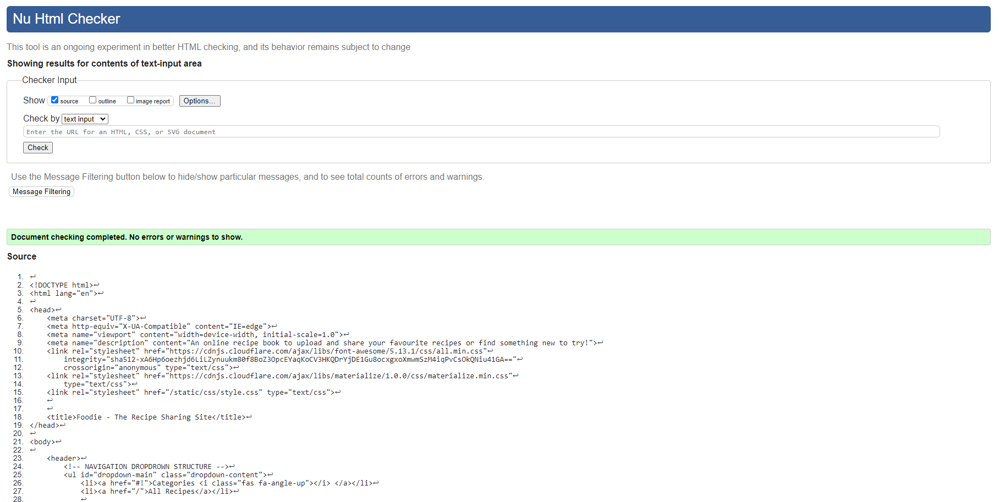

 

* ### <b>CSS</b>

    To test my CSS code, I used the [W3C CSS Validator](https://jigsaw.w3.org/css-validator/)

    When I first ran the validator, it returned the following errors:

    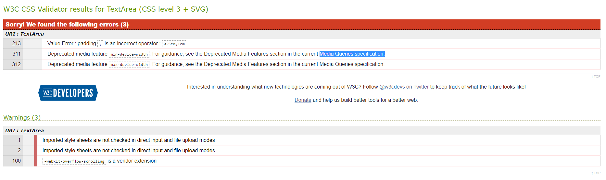

    The first error was simply a typing error and once the ',' was removed the error was cleared.

    The next two errors were due to the sizes I had entered as the parameters for the media queries. I had entered the dimensions incorrectly, setting a parameter of 319px instead of 320px for example. I had also generated 2 media queries to cover 2 screen dimensions, I then realised I could achieve the desired results with a much simpler query, setting the page logo to a smaller size for screen widths of less than 768px.

    Once I made the changes above, the errors were then cleared. However there are 3 remaining warnings within the CSS validation, these errors related to external style sheets as part of the Materialize style sheets and extensions.

    Here is the pass report:

    

 

* ### <b>Javascript</b>

    To test my Javascript code, I used the [JSHint Validator](https://jshint.com/)

    The initial report showed that I had an instance that was no longer being used, to correct this error I removed this instance.

    Further errors were listed (as shown below) that related to the validator reporting that each '$' was an undefined variable.
    I believe this is an issue within the validator itself. It is trying to determine that the '$' is a variable in itself.
    I therefore ignored these errors as the functions would not work correctly without the '$'.

    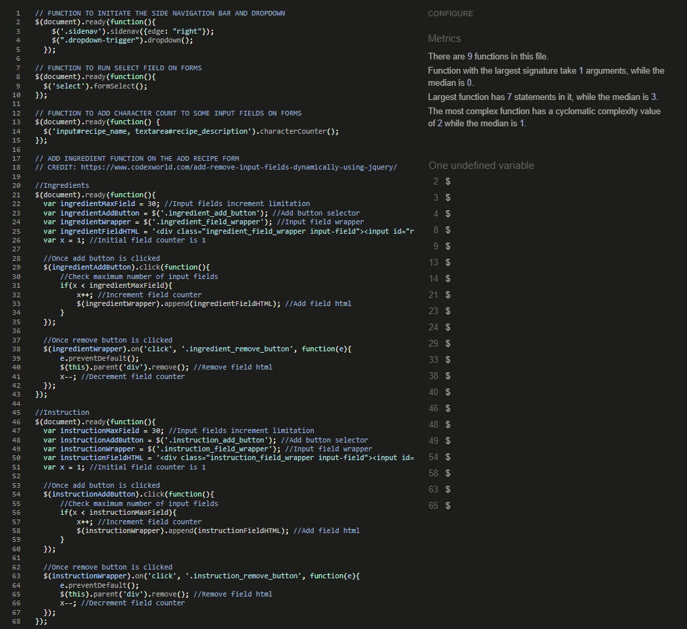

 

* ### <b>PEP8 Compliance</b>

 ]

* ### <b>Overall Website Performance & Compatibility</b>

    To test my websites performance and compatibility, I used [Lighthouse](https://developers.google.com/web/tools/lighthouse)

    The initial lighthouse report showed that there was a significant issue with the accessibility score that related to the choice of colors that were used for the site.

    There were areas of the site that did not meet the color contrast requirement of the site. A poor contrast between colors can often be difficult and uncomfertable for users to see. To help improve this score and to ensure the site is easy to read, I altered some of the poorly contrasting colors and made sure that any background colors work well with the foreground colors.

    Once I rectified this issue, I ran the tests again and the results showed a poor rating for the performance. 

    

    These errors were due to load times for the images being used for the recipes on the site, as these are external URL's to images then I have no control of the size or format of image that the user has uploaded. I researched what options were available to deal with images being loaded from URL's and the only solution I found was to include '?tr=q-10' at the end of the image URL's. This reduces the quality of the image to 20% when loading.  This increased my performance score from 70 to 73.

    There was also a drop in the SEO score after adding the pagination feature to the site. The report recognised the pagination links as 'href' and has a requirement for formatting these in order to make the links crawlable for search engines. As this is generated automatically, I was not able to improve this score.

    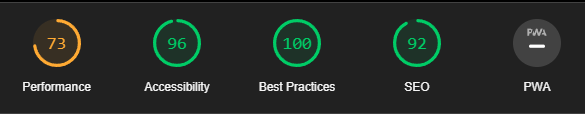

    In the future I would like to include the possibility for users to upload and store the images onto the websites server, this will help manage file sizes, and types in order to improve load times.

 

* ### <b>Responsive Design</b>

    In order to maintain a good responsive design for the site, I tried to use the Materialize CSS classes for the majority of the design.
    This helped generate suitable layouts for the recipes that adapt automatically if the display dimensions change.
    Using the Materialize classes also helped reduce the number of media queries that had to be written, this keeping the amount of CSS code to a minimum.

    In order to test the design on as many devices as possible, I came across a website called [Responsive Test Tool](http://responsivetesttool.com/)
    It enabled me to test my design on a large range of devices.

* ### <b>Browser Compatibility</b>

    To test my site's compatibility, I found a website called [Browserling](https://www.browserling.com/)

    Using this tool I was able to test a range of browsers, some of which I wouldn't otherwise have access to.
    Unfortunatley the site has a limited free version, and an upgrade to a premium plan would be required to access every device they offer, however i'm confident that the site is very compatible on the most popular browsers.

    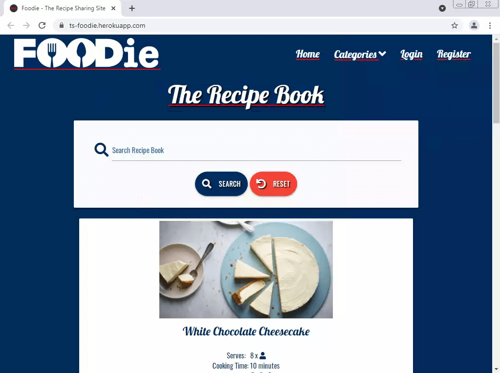
    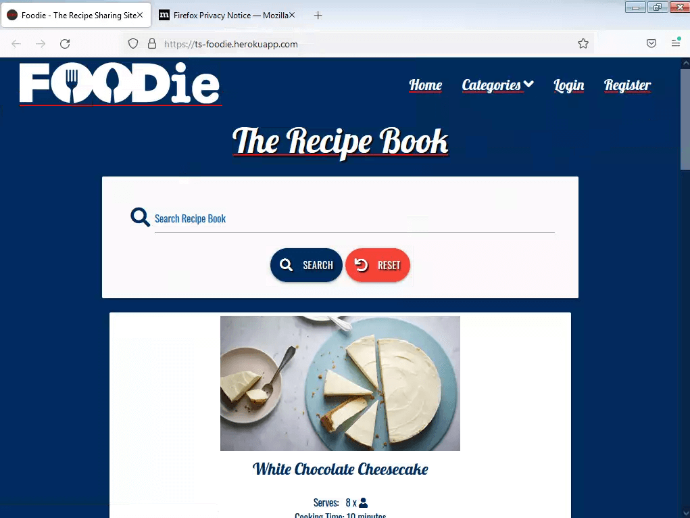
    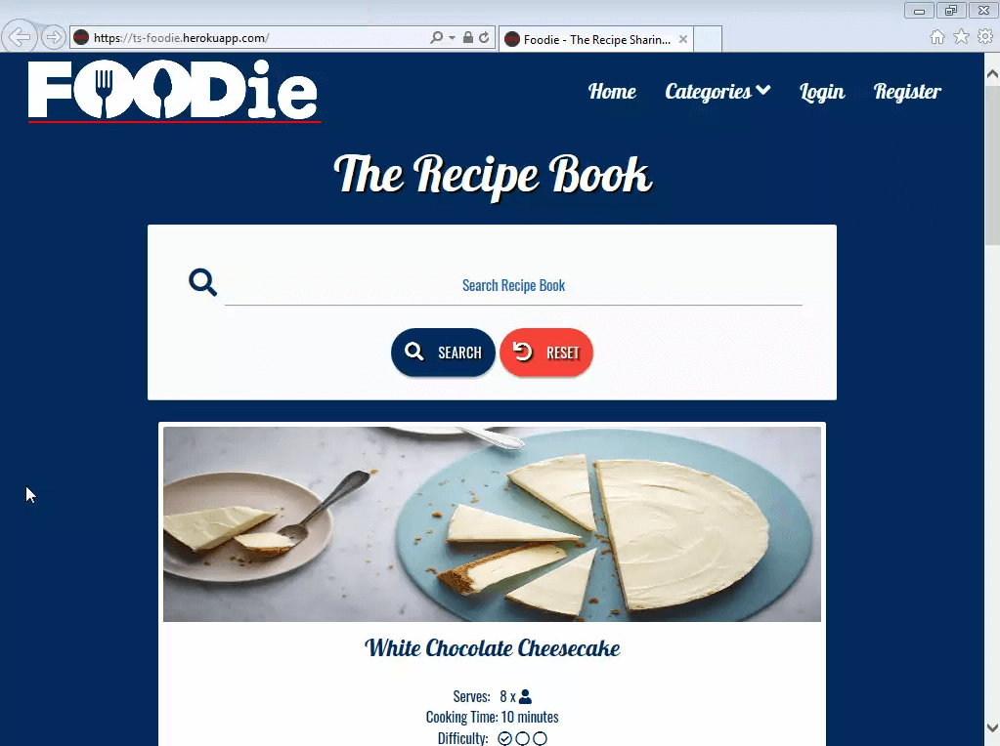
    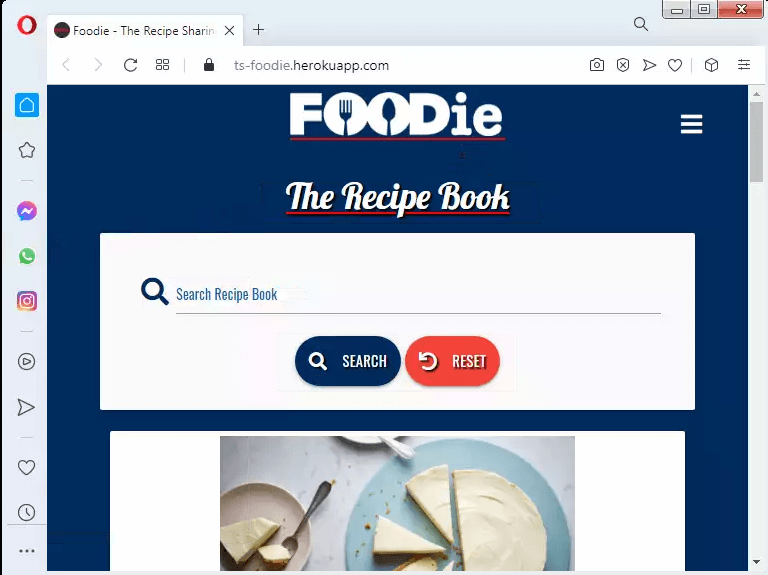

* ### <b>Link Testing</b>

    In my last project, I tested all the website links manually by navigating the site myself. The problem I found was that there were links that I had forgotten about which meant there were many left unchecked.
    For this project i've found an online tool called [Dead Link Checker](https://www.deadlinkchecker.com/) which scans the whole site for links and tests to make sure they are all correct. This has worked great and provided a detail report on its results. However, I felt it was important that not only were the links complete, but that they are directing the users to the correct places. 
    As this is not a test that the online tool can carry out, I browsed the site and followed the links to make sure they were opening the correct sites.

    Here are the results from the [Dead Link Checker](https://www.deadlinkchecker.com/):

    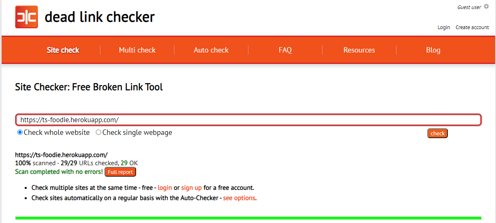

 

* ### <b>User Story Testing</b>

    * <b>User Experience</b>

        - When I visit the site, I want to know that I have landed on the correct site that I intended to visit.

            When users arrive at the site, there is a clear and bold logo visible straight away. 
            This is followed by a large title of 'recipe book' followed by some recently uploaded recipes.

            I believe this is a suitable opening site that allows the users to quickly know they have arrived at the correct page.

            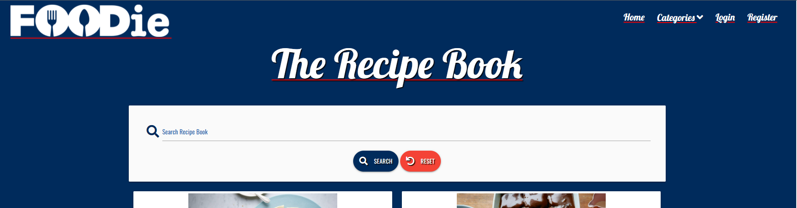

        - I need to be able to navigate to the key elements of the site quickly.

            Similar to many sites, the navigation bar can be found at the traditional location on the page at the top right.
            I think this makes it easy for the user to know where to go to find the navigation bar and locate the links to the key elements of the site.

            

        - The website should load correctly on any device.

            I have carried out testing on the site on different devices using both virtual devices and on devices that I own.
            By using the materialize classes, I feel the website performs well on a large range of popular devices.

            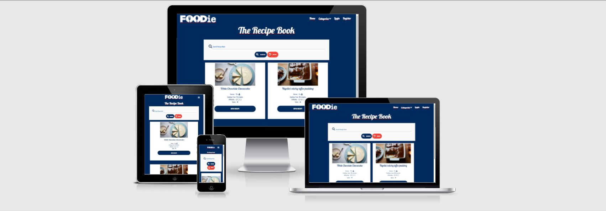

        - The website should load quickly and only load the necessary files required to display the key elements of the site first to improve load times.

            This was an area that was a little tricky to deal with, however I was able to make minor changes to help improve load times.
            Unfortunatley, as the website was sourcing the recipe images using URL's provided by the site users, this meant that there were increased load times.
            To help improve these times I changed the amount of recipes that were being displayed on the homepage using pagination and also deferred some scripts and links from loading at the initial load of the page.

            To monitor my results and how the changes I made affected the score, I used [Lighthouse](https://developers.google.com/web/tools/lighthouse)

            The results of the load times can be found <a href="#testing-lighthouse">Here</a>

        - Site visitors should be able to find social links to engage and share recipes to friends through their social media connections.

            The internet is strongly used for social networking and users will often share with friends websites that they discover. To help attract more users to the site, social links are important platforms for users to engage and share with, in turn bringing more users to the site.

            The social links for Foodie are located within the footer of every page, and I have used the easily recognize logo's for each social site to make the presentation of this part of the site more appealing to users.

            

    * <b>First Time Visitor Goals</b>

        - First Time Visitors, should be able to understand the purpose and reason for the site.

            As soon as the user lands on the site, they are presented with a minimal looking site, with a logo that stands out and gives the instant impression of a website associated with food. Without having to scroll or move the page in anyway, the title of 'The Recipe Book' is clearly visible and below it is an easy to navigate selection of recipes for the user to see.

        - First Time Visitors, should be able to easily find the navigation links.

            Following the most commonly used layout for the navigation bar, users are able to find the navigation links to work their way around the site in the top right hand corner of the page. The labels for navigation link are clean and easy to understand and read. For a user not logged into the site, the only dropdown menu within the navigation bar is to display the recipes by different categories. This keeping the navigation menu simple and minimal.

        - First Time Visitors, should be able to interact with the site upon landing on the site.

            When visiting the site, the recipes that have been uploaded to the site are presented to the user on the initial landing area. 
            Users are able to see a photo of the recipe, see the title of the recipe, see a quick summary of what kind of recipe it is followed by a large button that they can click to open the recipe to find out what the ingredients are and how to cook it.

            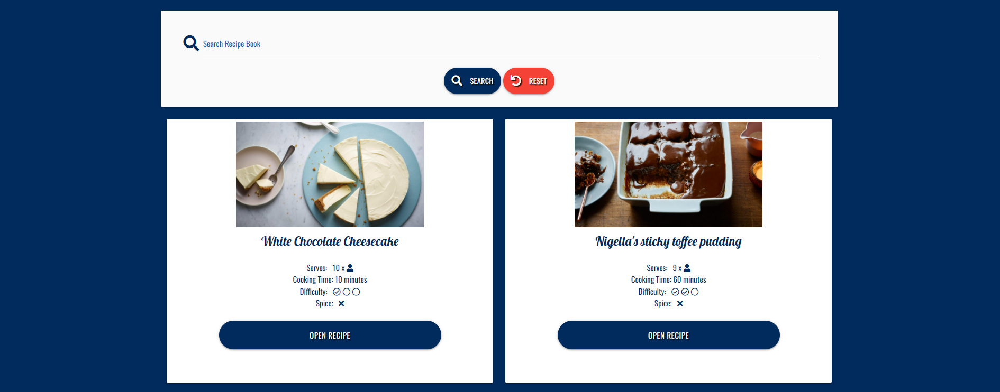

        - First time users should be able to view the recipes on the site without having to log in or register for an account.

            The homepage that the users are taken to displays all the recipes that have been uploaded to the site. User do not have to register or be logged in to browse, search, categorize or open the recipes.

        - First time users are likely to be un-registered users and must have restricted access to certain areas of the site.

            To maintain restricted access to elements of the site, the navigation bar has links that will not display unless the user has a certain account level.
            e.g. a standard user will have an additional option to 'add a recipe' within the navigation bar, however the option to 'manage categories' will not be visible to them as this requires an administrative level of access.

            To prevent users navigating to restricted sites using direct url's, each restricted page has a function that validates the user's access level before displaying the site. If the user has the correct access rights, the page displays as normal, if they do not have the necessary user access level then the page will display a message making them aware of this.

            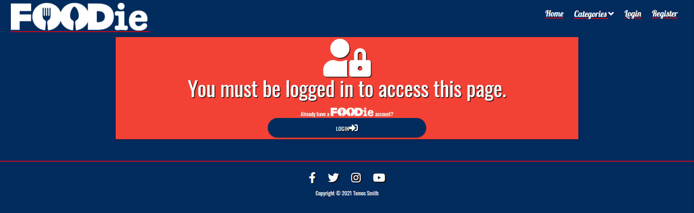

        - First time users are able to navigate the site without registering. However in order to submit a recipe to the site, users must register and therefore the user must be able to locate the Register link on the hompeage easily and quickly.

            A first time user to the site will be able to experience the basic functions of the site. The basic navigation menu has minimal links of which the login and register links are part of. The user can find and register with the site by clicking the link and they are taken to a short form and can be logged into the site with ease.

            The user will also be reminded with the options to login should they navigate to a part of the site that they do not have an account.

    * <b>Returning Visitor Goals</b>

        - A returning visitor would typically be a user that has already registered with the website, therefore the user should be able to locate the log in link easily and quickly on the homepage.

            A returning visitor can quickly log in to the page using the log in button on the navigation bar.
            This will take them to a page to enter and submit their login information.

        - A returning visitor should be able to make changes to any recipes they have uploaded onto the site, but must not be able to edit or remove entries entered by the site admin or other users.

            When the user logs into the site, they are taken to a page that shows all of the recipes that they have uploaded to the site.
            This page ONLY displays the recipes they have uploaded and provided that the session username matches the username in the database attached to the recipe, it will display the options to edit or delete the recipe.

            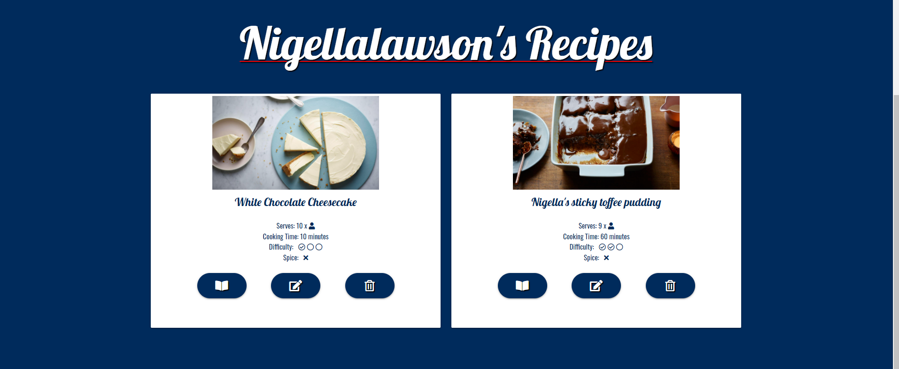

    * <b>Website Administrator Goals</b>

        - The website administrator must be able to find the administrator tools when logged into the site.

            When a user is logged into the site with administrator privilidges, the navigation bar displays additional links that are options only available to an administrator.
            The tools that the administrator requires in order to manage the site are listed within the dropdown link 'Manage Site' shown on the navigation bar.

            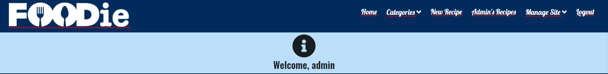

        - The website administrator must be able to create, remove, update and delete recipe categories.

            The administrator can click on 'Manage Categories' under the 'Manage Site' tab on the navigation bar, where they can then see a list of categories currently listed on the site. Beside each category is the choice edit or delete the category, or at the bottom of the list there is a button to add a new category to the list.

            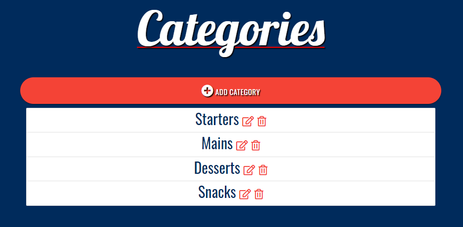

        - The website administrators must be the only users to have access to the restricted websites and non-administrators must not be able to access restricted sites by direct URL inputs.

            Each administrator only sites have code to make sure the page administrator is logged in before displaying the chosen page.
            If user logged into the site is the administrator, they will be presented with a message explaining that administrator rights are required to access this page followed by the option to login with an administrator account.
            Should the user be logged in with the administrator account the page will load with the restricted content.

            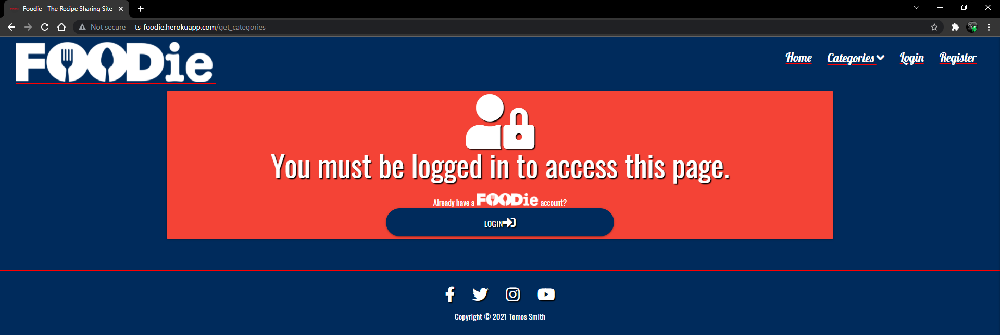

* ### <b>Problems During Development</b>

    -   When using the search function to search for recipes, entering a blank search would return an error, therefore I had to include an IF statement that would display the main page with all recipes if the user was to search a blank field.

    -   Accessing the get_categories (without being logged in) using a direct URL would open an error page. The reason for this was because the function had a conflicting function within the page template itself. Once I removed one of the functions, it operated correctly.

 

* ### <b>Known Bugs</b>

    -   The recipe pages submit the instructions and ingredients to the database as a list array. These submit correctly and display as they should within the mongodb databases.
        However, on some occassions only 1 of each instruction/ingredient is returned to be displayed on the page. 

        I have read through the code for both submitting and returning the information and made some minor alterations to ensure this information is passed, stored and returned correctly. Since carrying out these changes and running some tests that I feel would repeat the problem, i've not yet had the bug re-appear. 
        It is possible that the tests I have carried out are not the tests that are responsible for this, however I will continue to monitor the site and carry out any necessary changes in the future.

 

## <b>Deployment</b>

* ### <b>Deployment Through GitHub Pages</b>
* ### <b>Forking</b>
* ### <b>Cloning Project</b>
* ### <b>Administrator Access Credentials</b>

## <b>Credits</b>

* ### <b>Content</b>

    The recipes were sourced from [BBC Food](https://www.bbcgoodfood.com/)

* ### <b>Media</b>

    The images for the recipes were all sourced from [BBC Food](https://www.bbcgoodfood.com/).

* ### <b>Code</b>

    Function to add additional fields to form: https://www.codexworld.com/add-remove-input-fields-dynamically-using-jquery/

    Pagination to organise the recipe cards: https://harishvc.com/2015/04/15/pagination-flask-mongodb/

* ### <b>Acknowledgements</b>