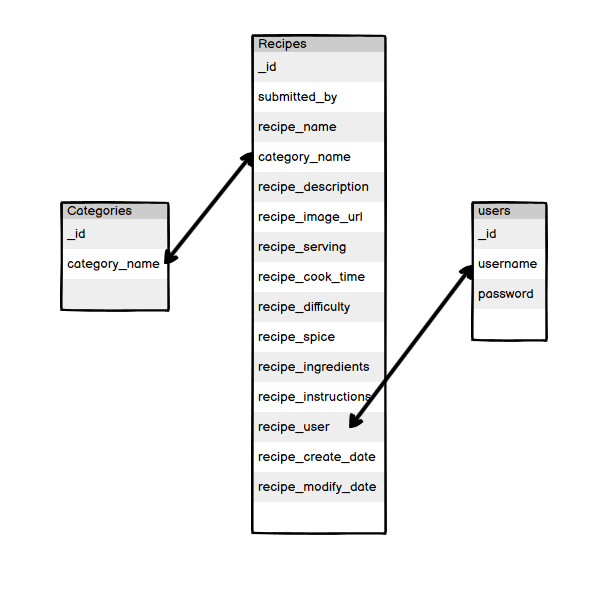

----

    This is the README file for my Code Institute MS3 project site, Foodie - The Recipe Sharing Site

    This project is the 3rd project as part of the Code Institute Full Stack Development course. The projects are set in order to demonstrate my understanding of what we have learnt during the previous units.
    The task set for this project is to demonstrate the ability to create a fully responsive web application that allows users to interact and manipulate with data stored in a database.

 

[CLICK HERE TO VISIT THE LIVE SITE](https://ts-foodie.herokuapp.com/) 

----
 

# Table Of Content:

- <a href="#project_goals">Project Goals</a>
- <a href="#ux">User Experience (UX)</a>
    - <a href="#ux-user_stories">User Stories</a>
    - <a href="#ux-design">Design</a>
        - <a href="#ux-design-color">Color</a>
        - <a href="#ux-design-color">Typography</a>
        - <a href="#ux-design-color">Images</a>
        - <a href="#ux-design-structure">Structure & Mockup Designs</a></a>
        - <a href="#ux-design-amendments">Amendments To Mockup Designs During Development</a></a>
- <a href="#features">Features</a>
    - <a href="#features-current">Current Features</a>
    - <a href="#features-future">Possible Future Features</a>
- <a href="#database">Database</a>
- <a href="#key-components">Key Components</a>
    - <a href="#key-components-languages">Languages</a>
    - <a href="#key-components-frameworks">Frameworks & Libraries</a>
    - <a href="#key-components-others">Others</a>
- <a href="#testing">Testing</a>
    - <a href="#testing-problems-during-development">Problems During Development</a>
    - <a href="#testing-bugs">Known Bugs</a>
- <a href="#deployment">Deployment</a>
    - <a href="#deployment-github">Deployment Through GitHub Pages</a>
    - <a href="#deployment-forking">Forking</a>
    - <a href="#deployment-cloning">Cloning Project</a>
    - <a href="deployment-admin">Administrator Access Credentials</a>
- <a href="#credits">Credits</a>
    - <a href="#credits-content">Content</a>
    - <a href="#credits-media">Media</a>
    - <a href="#credits-code">Code</a>
    - <a href="#credits-acknowledgments">Acknowledgements</a>

----

# Project Goals

*   Design, develop and implement a full stack web application using HTML, CSS, JavaScript, Python, Flask and MongoDB
*   Identify and apply necessary security features

# User Experience (UX)

    This section is designed to generate possible scenarios of the typical end user that would use this website. 
    This will help ensure end user requirements are designed into the website.

    To create a web application that offered a good experience to the user, I found that a minimal and simplistic style would be the best approach. 
    Not only does this keep the site easy to use, it also makes sure that the users aren't over powered with all the information the database may store/display.   

    A key priority was to try to make the journey from entering the site to displaying a recipe as quickly and clean as possible.

## <b>User Stories</b>

* ### <b>User Experience</b>

    - When I visit the site, I want to know that I have landed on the correct site that I intended to visit.

    - I need to be able to navigate to the key elements of the site quickly.

    - The website should load correctly on any device.

    - The website should load quickly and only load the necessary files required to display the key elements of the site first to improve load times.

    - Site visitors should be able to find social links to engage and share recipes to friends through their social media connections.

* ### <b>First Time Visitor Goals</b>

    - First Time Visitors, should be able to understand the purpose and reason for the site.

    - First Time Visitors, should be able to easily find the navigation links.

    - First Time Visitors, should be able to interact with the site upon landing on the site.

    - First time users should be able to view the recipes on the site without having to log in or register for an account.

    - First time users are likely to be un-registered users and must have restricted access to certain areas of the site.

    - First time users are able to navigate the site without registering. However in order to submit a recipe to the site, users must register and therefore the user must be able to locate the Register link on the hompeage easily and quickly.

* ### <b>Returning Visitor Goals</b>

    - A returning visitor would typically be a user that has already registered with the website, therefore the user should be able to locate the log in link easily and quickly on the homepage.

    - A returning visitor should be able to make changes to any recipes they have uploaded onto the site, but must not be able to edit or remove entries entered by the site admin or other users.

* ### <b>Website Administrator Goals</b>

    - The website administrator must be able to find the administrator tools when logged into the site.

    - The website administrator must be able to add and remove administrator to the administrator access database.

    - The website administrator must not be able to delete the main administrator account from the database.

    - The website administrator must be able to create, remove, update and delete recipe categories.

    - The website administrators must be the only users to have access to the restricted websites and non-administrators must not be able to access restricted sites by direct URL inputs.

## <b>Design</b>

* ### <b>Color</b>

    When choosing the most suitable color scheme for the site, I decided to list the main points of what I wanted to try to create from the design.

    Here are the key points to consider when choosing the colors:

    * Eye Catching
    * Comfertable
    * Color Compatibility

    I chose to develop both the logo and the main site theme at the same time to ensure that they could work well together. 
    The colors were going to be an important part of the design in order to create a brand that could be applied throughout the company should it be required in the future.

    To choose a compatible color scheme, I decided to use [Adobe Color](https://color.adobe.com/) to find colors that would work well together. 
    I began by choosing a base color that I thought would work well for the brand, then entered the color codes into the site and it came up with other colors that would work well in combination with the colors I had already entered. When [Adobe Color](https://color.adobe.com/) displayed the result, it stated 'No conflicts found. Swatches are color blind safe.'

    

    After finding the colors I felt were most suitable I implemented them into the site, in later stages of development I began testing the site's compatibility using [Adobe Color](https://developers.google.com/web/tools/lighthouse) and it was brought to my attention that the way I was using the colors was not meeting lightroom's accessibility criterias due to contrasting colors. I have explained further in my testing section on the steps I had to take to overcome this issue.

* ### <b>Typography</b>

    When choosing which font to use as part of my design, I felt it was important for it to be easy to read but have similar feel as a font you would choose for a restraunt menu. I wanted the font to be appropriate so that I could use it for the logo text and also the main site text. This would then help maintain a nice continuity within the design and also help create the 'Foodie' brand I was aiming for.

    I have used Google to source the fonts and these are loaded within the head of the page.

    The main font is [Lobster](https://fonts.google.com/specimen/Lobster?query=lobster)

    This is the font I used for fancy headings and labelling.

    The secondary font is [Oswald](https://fonts.google.com/specimen/Oswald?query=oswald)

    This font is used as a uniform font for all key information, keeping it easy to read.

* ### <b>Images</b>

    There is very little base images on the site, but does display a large amount of images based on the content uploads of the end user.
    The images for each of the recipes posted to the site are outsourced and the user must provided a url to the image of their recipe when uploading it to the site.
    These uploads then form the design of all the pages.

* ### <b>Structure & Mockup Designs</b>

    <h3> Homepage </h3>
    

    <h3> Registration Page </h3>
    

    <h3> Login Page </h3>
    

    <h3> Add Recipe Page</h3>
    

    <h3> Edit Recipe Page</h3>
    

    <h3> Manage Categories Page (Administrators Only) </h3>
    

* ### <b>Amendments To Mockup Designs During Development</b>

    During the development there were very minor changes to the original design I created. I had originally planned to have a landing page to welcome users to the site with a button that they could click to open the recipe book. However when I built this, it felt that having this feature increased the time it took for the end user to reach the purpose of the site. I made the decision to remove the opening page and direct users straight into the recipe book.

    I also felt that the site needed an additional feature for Administrators to be able to assign other administrators. As the number of users using the site increases, it would be useful for the Administrator to be able to share any administrative tasks with other users. I therefore chose to implement a page for anyone with administrative access to add/remove other administrators.

    

## <b>Features</b>

* ### <b>Current Features</b>

    * #### <b>User Access Structure</b>

        In order to manage the recipe uploads, the site needed to be able to restrict certain users from being able to carry out certain tasks on the site.
        Tasks such as:
            - A user <b>MUST</b> be registered and logged in to the site to upload a recipe.
            - A user <b>MUST</b> be logged in and the owner of the uploaded recipe to edit or remove the recipe.
            - The necessary user access requirements <b>MUST</b> be checked upon landing on every restricted site, even if the user enters the direct URL.

        In order to achieve this, all the restricted access sites have functions at the top of the site that will check if the user meets the necessary requirements. If they do, the content will load. If not, an error message will be displayed.

    * #### <b>Navigation Menu Based On User Level</b>

        

        There are additional items placed within the navigation menu that are only displayed depending on the user's log in state.
        I felt it was important that a user that is not logged in, shouldn't need to see the 'new recipe' button. The same would also apply for a user that is logged in that shouldn't see all of the navigation options that an administrator would see.

        To overcome these issues, there are if statements within the navigation menu code that checks the state of the user and displays the relevant options based on the result.

    * #### <b>Dynamically Created Navigation Menu Dropdown</b>

        Administrators of the site are able to edit the different recipe categories.
        These categories are then listed as options within a dropdown in the navigation menu so that the site user can see a all the recipes that are uploaded to the site based on the category they choose.

        When an administrator adds/removes a category from the site, the navigation item 'categories' will automatically update to show the changes made by the administrator.

    * #### <b>Read Only Access To Recipes For Unregistered Users</b>

        It was important that first time visitors to the site were able to see what the site was all about. The site will display all of the uploaded content to the un-registered user, however the un-registered user will not have access to add, edit, remove recipes but does have access to login or register for an account at anytime.

    * #### <b>User Account</b>

        In order to manage how the recipe's were managed, the site has a user account system. Users can create an account with the website that will allow them to log in and extend the functionality of the site.

    * #### <b>User's Recipe Collection & Management Page</b>

        I felt it was important for a user to be able to manage their uploads in a quick and easy way and to do this, I created a user recipe page.
        When a user succesfully logs in, they will be re-directed to a page that displays all of the recipe's they have uploaded.
        From here they have the option to open, edit or delete any of the displayed recipes.
        They can also visit this page by clicking the {{username}}'s Recipes link within the navigation bar. This link will automatically update to display the session user's username for a more personal interaction with the site.

    * #### <b>Administrator Account</b>

        To manage the site, I created an administrator account. This account provides the user with all priviledges to manage the website.

        The administrator is able to:
            - create or remove additional recipe categories
            - create or remove additional administrators to the site

* ### <b>Possible Future Features</b>

## <b>Database</b>

## <b>Key Components</b>

* ### <b>Languages</b>

* ### <b>Frameworks & Libraries</b>

* ### <b>Others</b>

## <b>Testing</b>
* ### <b>Problems During Development</b>
* ### <b>Known Bugs</b>
* ### <b>HTML</b>
* ### <b>CSS</b>
* ### <b>Javascript</b>
* ### <b>Overall Website Performance & Compatibility</b>
<< MENTION COLOR CONTRASTS >>
* ### <b>Responsive Design</b>
* ### <b>Browser Compatibility</b>
* ### <b>Link Testing</b>

## <b>Deployment</b>

* ### <b>Deployment Through GitHub Pages</b>
* ### <b>Forking</b>
* ### <b>Cloning Project</b>
* ### <b>Administrator Access Credentials</b>

## <b>Credits</b>

* ### <b>Content</b>

* ### <b>Media</b>

* ### <b>Code</b>

Function to add additional fields to form: https://www.codexworld.com/add-remove-input-fields-dynamically-using-jquery/

* ### <b>Acknowledgements</b>